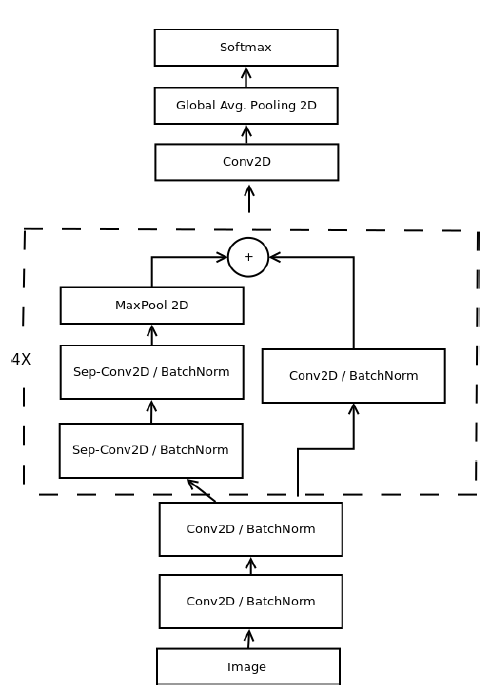
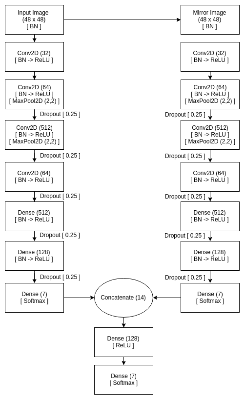
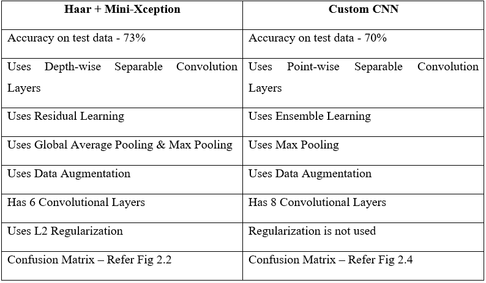
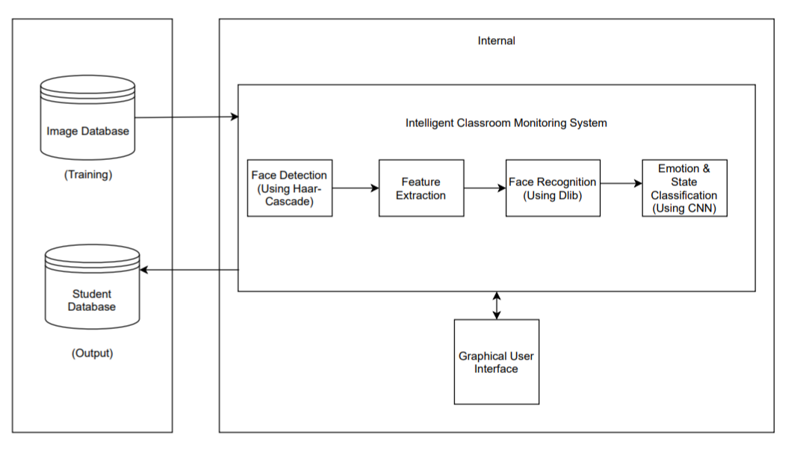
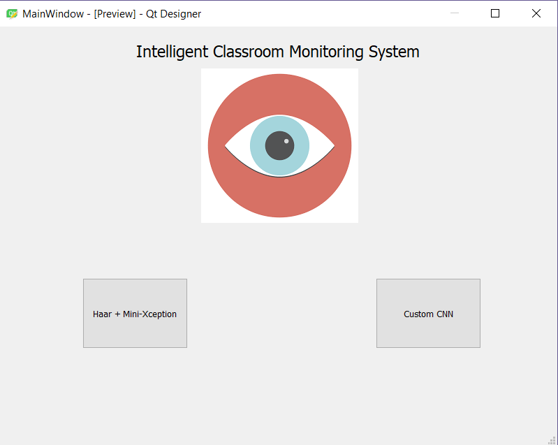

# Real-Time-Classroom-Monitoring-System
A real time system for classrooms for attendance and gathering attention data of each student. The system identifies the name of the subject using dlib and recognises the emotion being expressed by them. This emotion is associated with the subject as either Attentive/Distracted. This will be done for each student in the classroom and the time for which each student is Attentive or Distracted will be recorded. Attendance will also be taken into account if a certain subject is detected for a certain number of times to count as present in the classroom

Compared 2 techniques for the Facial Expression Recognition Task:-
## Haar + Mini-Xception

## Ensemble Learning/ Custom Architecture

# How They Compare

## General Architecture

## User Interface

## Publication
https://thinkindiaquarterly.org/index.php/think-india/article/view/9080
